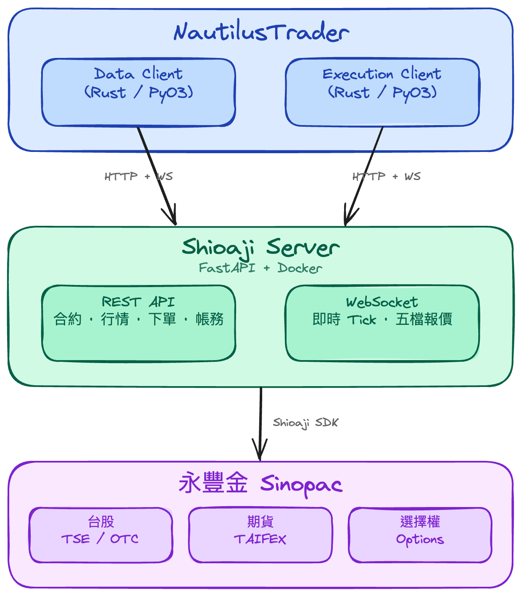

# Architecture 系統架構

## Overview 概覽

Shioaji Server 是一個 **協定轉換閘道器**，將永豐金 Shioaji Python SDK（同步、callback-based）轉換為標準 REST API + WebSocket 介面，讓 NautilusTrader 的 Rust/PyO3 adapter 可以透過網路協定操作台灣市場。



---

## 部署模式

### Docker（推薦）

```
Host                              Container (/app)
─────────────────                 ─────────────────
.env           ──mount(ro)──►    .env
Sinopac.pfx    ──mount(ro)──►    Sinopac.pfx
server.log     ──mount(rw)──►    server.log

Makefile 自動設定 -e CA_PATH=/app/Sinopac.pfx
覆蓋 .env 中的 host 路徑
```

`Makefile` 負責編排 `docker build` / `docker run`，包含：
- 自動 build image（首次 `make up`）
- 從 `.env` 讀取 `SHIOAJI_SERVER_PORT` 設定 port mapping
- 用 `-e CA_PATH` 覆蓋 container 內的憑證路徑
- mount `server.log` 讓 host 可直接 `tail -f`

### 本地執行

直接 `uv run shioaji-server`，`__main__.py` 從 cwd 載入 `.env`。

---

## 元件職責

### `__main__.py` — 入口

- 載入 `.env` 環境變數（搜尋 cwd → parent dir，或 `SHIOAJI_ENV_FILE`）
- 解析 CLI 參數（`--live`）
- 設定 logging：`logging.basicConfig` + uvicorn `log_level`，並加一個 `RotatingFileHandler`
  寫入 `SHIOAJI_LOG_FILE`（預設 `server.log`，10 MB × 3 份）——這就是 Docker 把
  `server.log` bind-mount 出來、host 可直接 `tail -f` 的原因
- 啟動 uvicorn

### `app.py` — FastAPI 應用

- 定義 `lifespan`：啟動時建立 `ShioajiGatewaySession` → 自動登入 →（登入成功才）註冊 WS callbacks，關閉時 logout
- `_auto_login`：讀取環境變數嘗試登入，缺少時印出設定提示但不 crash
- 掛載所有 route routers + RuntimeError handler
- `/ws` WebSocket 端點：處理行情訂閱/取消訂閱
- `/api/health` 健康檢查：回傳 `{status, logged_in, session_alive, connected}`，其中
  `connected = logged_in AND session_alive`。`logged_in` 只是登入旗標，`session_alive`
  則是 `check_session()` 對後端的真實探活——兩者分開才能區分「從未登入」與「session 靜默失效」

### `session.py` — ShioajiGatewaySession

SDK 的核心封裝層，解決兩個問題：

1. **同步轉非同步**：Shioaji SDK 全部是同步 blocking call，透過 `run_in_executor` 包成 async
2. **Callback 路由**：SDK 的行情/委託 callback 是在獨立 thread 觸發，透過 `register_callbacks` 將資料路由到 WebSocket manager

```python
@dataclass
class ShioajiGatewaySession:                # 選列重點欄位/方法（實際欄位更多）
    api: sj.Shioaji                         # SDK 實例
    connected: bool                         # 登入旗標（注意:靜默死亡時會謊報 True）
    simulation: bool                        # 模擬/正式
    _lock: asyncio.Lock                     # 序列化 login / logout / _relogin
    keepalive_interval: float = 5.0         # watchdog 探活間隔
    keepalive_fail_threshold: int = 2       # 連續探針失敗門檻 → 觸發復原
    _keepalive_task / _recovery_task        # 背景 watchdog / 復原 task handle
    _logout_requested: bool                 # logout 權威性旗標（見下）
    _reconnecting + _reconnect_lock         # 把並發復原收斂成一次

    async def login(...)        # 非同步登入（executor）+ 尾端 start_keepalive()
    async def logout(...)       # 開頭 stop_keepalive() + 非同步登出
    async def run_sync(fn)      # 把任意同步 SDK call 包成 async
    async def check_session(force=False)    # 真實探活:打 api.usage()，結果快取 ttl
    def register_callbacks()    # 註冊 SDK callback（含 session_down）→ WS manager
    def start_keepalive() / stop_keepalive()        # watchdog 生命週期
    async def _handle_session_down() / _relogin()   # 復原:重登 → 重註冊 → 重訂閱
```

#### 靜默死亡自癒 keepalive watchdog

後端 Solace session 可能**靜默失效**（凌晨常見）：不發 SDK `session_down` callback、`connected` 旗標仍謊報 `True`，但任何真正的呼叫都會 `SessionNotEstablished`。為補這個缺口，`ShioajiGatewaySession` 內含一條背景 asyncio task：

- **探活**：每 `keepalive_interval` 秒（預設 `5.0`）打一筆 `check_session(force=True)`（底層 `api.usage()`，`force=True` 繞過 `session_probe_ttl` 快取以取得當下真相）。
- **觸發**：連續 `keepalive_fail_threshold`（預設 `2`，過濾瞬間 blip）次探針失敗、且 `connected` 仍為 `True`（=靜默死亡）→ 透過 `_schedule_recovery`（`asyncio.create_task`）觸發既有的 `_handle_session_down`，**複用同一套 re-login / re-register / re-subscribe 復原**，不寫新邏輯。
- **與既有兩個機制互補**：
  - SDK 的 `session_down` callback（`_schedule_reconnect`）只蓋 **SDK 主動回報**的斷線；
  - `shioaji-data` CLI 端的 2330 kbar 探針只是**下游守門**（死的就拒跑，能拒不能修）；
  - watchdog 是 **server 端自癒**，專蓋「靜默死亡」這個缺口。三者最終都進同一支 `_handle_session_down`（`_reconnecting` 鎖把並發觸發收斂成一次，同時響也安全）。
- **生命週期**：`login()` 成功尾端 `start_keepalive()`（idempotent）、`logout()` 開頭 `stop_keepalive()`（cancel + await + 清 `None`）；`_relogin()` 不碰它（觸發它的 watchdog 本來就還在跑）。`keepalive_interval` / `keepalive_fail_threshold` 是 dataclass field，可調而不動邏輯。

**已解決 / follow-up：**

- **logout-races-recovery（RESOLVED）**：原問題是 watchdog 在 `logout()` 前一刻才 `_schedule_recovery()` 時，`stop_keepalive()` 只 cancel keepalive loop task、不會 cancel 另一條 in-flight 的 `_recovery_task`，於是 `_handle_session_down` → `_relogin` 可能重登一個剛登出的 session。現以**旗標式權威（flag-based authority）**修正：`logout()` 第一件事就設 `_logout_requested = True`；`_relogin()` 在其 `_lock` 區塊頂端、`_handle_session_down()` 在 retry 迴圈頂端都檢查此旗標並 `return`，於是 logout 對並發復原具有權威性（登出後不得被復原翻回 connected），`login()` 在 commit 前清旗標讓後續重登仍可生效。**刻意不 cancel `_recovery_task`**：`_relogin` 經由 `loop.run_in_executor(None, self._login_sync)` 重建 SDK，executor future 並非真正可取消——cancel asyncio task 只會放棄 await，thread pool 仍把 `_login_sync` 跑完、在 logout 之後把 `self.api` 換成剛登入的 SDK，反而與 logout 的 `_logout_sync` 撞同一個 `self.api`。改走旗標 + 既有 `_lock` 序列化後，`_relogin` 永遠在 `_lock` 下完整跑完、不會被半路 cancel，因此沒有 orphaned-executor 危險（最壞情況只是復原在 backoff 中多睡一會、醒來見旗標即 return，無重建、無活 session）。
- **可選 follow-up**（不在此範圍）：`POST /api/auth/reconnect` 端點直接呼叫 `_handle_session_down`，給維運一個手動槓桿（design doc 提及）。

### `ws/manager.py` — ConnectionManager

管理 WebSocket 連線和行情分發：

- **訂閱追蹤**：`subscriptions: dict[(code, quote_type), set[WebSocket]]`
- **引用計數**：第一個 client 訂閱時才向 SDK subscribe，最後一個取消時才 unsubscribe
- **跨 thread 分發**：SDK callback thread → `asyncio.run_coroutine_threadsafe` → async broadcast
- **委託推送**：`broadcast_order_update` 推送到所有已連線 client

### `models.py` — Pydantic Models

所有 request/response 的資料結構定義，分為：

- **Auth / System**：`LoginRequest`, `LoginResponse`, `StatusResponse`, `HealthResponse`
- **Contracts**：`StockContract`, `FuturesContract`, `OptionsContract`
- **Market Data**：`SnapshotData`, `TicksResponse`, `KBarsResponse`
- **Orders**：`PlaceOrderRequest`, `UpdateOrderRequest`, `CancelOrderRequest`, `TradeInfo`，加上下單列舉 `Action` / `PriceType` / `OrderType` / `OrderCond` / `OrderLot`（定義可接受的 wire 值）
- **Account**：`Position`, `AccountBalance`, `MarginInfo`, `ProfitLoss`, `UsageResponse`（每日流量配額）

### `errors.py` — 錯誤處理

將 `RuntimeError` 映射為 HTTP status codes：
- `Not connected` → 503
- `Already connected` → 409
- 其他 → 500

### `data/` — `shioaji-data` 歷史資料 CLI

獨立子套件，經 `pyproject.toml` 的 `shioaji-data = "shioaji_server.data.cli:main"` 暴露為 CLI。
它是 gateway 的**下游 client**（透過 HTTP 打上面那些 `/api/*` 端點），把 Shioaji→NautilusTrader
的歷史資料下載/檢查管線收斂成單一指令，寫入 `ParquetDataCatalog`。與 gateway runtime 解耦
（gateway 不依賴它）。

| 檔案 | 職責 |
|------|------|
| `cli.py` | 唯一 CLI 層：argparse 前端 + dispatch。四個子指令 `fetch-bars` / `fetch-ticks` / `instrument-def` / `inspect`，共用 `--catalog` / `--gateway-url`。內含盤中截尾防護 `_effective_end`（台北 15:00 前 cap `--end` 到昨日）與兩段啟動探活 `_check_gateway`（`/api/health` + 真實 2330 kbar 探針）。退出碼 `0`/`2`/`1` |
| `client.py` | `ShioajiGatewayClient`：對 gateway REST 的 async `httpx` 包裝（`Semaphore(10)` 自我限流，避開 Sinopac 50 req/5s 上限） |
| `bars.py` | 1 分鐘 bar 引擎 + 續傳基元：`VENUE=Venue("SINOPAC")`、`BAR_SPEC`、`fetch_stock_bars`（月 chunk、retry-then-break）、`last_bar_date_in_catalog`。守住**連續前綴不變式**（錯誤不跳 chunk → catalog 永遠是無洞前綴 → 自動續傳安全） |
| `fetch.py` | 逐 ticker 驅動 + 批次/配額編排：`fetch_bars_one`/`fetch_ticks_one`/`write_instrument_def_one`（回 `TickerResult`）、tick→`TradeTick` 轉換、共享 `QuotaGate`、`run_batch`、`format_batch_report` |
| `inspect.py` | catalog 體檢報告（`inspect_catalog`）：列 equity 定義與 bar 品質（筆數/日期範圍/gap） |
| `instruments.py` | NT instrument 定義的單一事實源：`load_instrument()` 經 pyo3 `SinopacHttpClient` + `SinopacInstrumentProvider`，用**與 live node 相同的 Rust 解析**產出 tick/lot/multiplier/currency |

詳細操作（續傳、盤中保護、探活、退出碼）見 [README 的 `shioaji-data` 段](../README.md#資料下載--shioaji-data-cli)。

---

## Routes 路由

### `/api/health` — 系統健康

| Method | Path | 說明 |
|--------|------|------|
| GET | `/api/health` | `{status, logged_in, session_alive, connected}`；`connected = logged_in ∧ session_alive`（`session_alive` 為對後端的真實探活，非僅登入旗標） |

### `/api/auth` — 認證

| Method | Path | 說明 |
|--------|------|------|
| POST | `/api/auth/login` | 登入（支援 simulation 參數） |
| POST | `/api/auth/logout` | 登出 |
| GET | `/api/auth/status` | 查詢連線狀態 |

### `/api/contracts` — 合約

| Method | Path | 說明 |
|--------|------|------|
| GET | `/api/contracts/stocks` | 所有股票合約 |
| GET | `/api/contracts/stocks/{code}` | 單一股票合約 |
| GET | `/api/contracts/futures` | 所有期貨合約 |
| GET | `/api/contracts/options` | 所有選擇權合約 |

### `/api/orders` — 委託

| Method | Path | 說明 |
|--------|------|------|
| POST | `/api/orders/place` | 下單 |
| PUT | `/api/orders/update` | 改單（改價/減量） |
| DELETE | `/api/orders/cancel` | 刪單 |
| GET | `/api/orders/trades` | 查詢所有委託 |

### `/api/market` — 行情查詢

| Method | Path | 說明 |
|--------|------|------|
| GET | `/api/market/snapshots` | 即時快照（多檔） |
| GET | `/api/market/ticks` | 歷史逐筆成交 |
| GET | `/api/market/kbars` | 歷史 K 線 |

### `/api/account` — 帳務

| Method | Path | 說明 |
|--------|------|------|
| GET | `/api/account/positions` | 持倉查詢（`market=stock\|futures`，預設 stock） |
| GET | `/api/account/balance` | 帳戶餘額（股票，TWD） |
| GET | `/api/account/margin` | 保證金（期貨/選擇權；無期貨帳戶回 400） |
| GET | `/api/account/pnl` | 已實現損益（股票） |
| GET | `/api/account/usage` | 每日流量配額（已用/上限/剩餘 bytes），重抓資料前可先查 |

### `/ws` — WebSocket 即時行情

Client 發送 JSON 訊息訂閱/取消：

```json
{"action": "subscribe", "contract_code": "2330", "quote_type": "tick"}
{"action": "unsubscribe", "contract_code": "2330", "quote_type": "tick"}
```

Server 推送行情資料：

```json
{"type": "tick", "code": "2330", "data": {"close": 580.0, "volume": 1, ...}}
{"type": "bidask", "code": "2330", "data": {"bid_price": [...], ...}}
{"type": "order_update", "event": "...", "data": {...}}
```

---

## 資料流

### 下單流程

```
NT ExecClient                Shioaji Server              Sinopac
     │                            │                        │
     │  POST /api/orders/place    │                        │
     │ ─────────────────────────► │                        │
     │                            │  api.place_order()     │
     │                            │ ─────────────────────► │
     │                            │ ◄───────────────────── │
     │  {"trade_id", "status"}    │                        │
     │ ◄───────────────────────── │                        │
     │                            │                        │
     │                            │  order callback        │
     │  WS: order_update          │ ◄───────────────────── │
     │ ◄─ ─ ─ ─ ─ ─ ─ ─ ─ ─ ─ ─ │                        │
```

### 即時行情流程

```
NT DataClient                Shioaji Server              Sinopac
     │                            │                        │
     │  WS: subscribe 2330/tick   │                        │
     │ ─────────────────────────► │                        │
     │                            │  api.quote.subscribe() │
     │                            │ ─────────────────────► │
     │  WS: {"type":"subscribed"} │                        │
     │ ◄───────────────────────── │                        │
     │                            │                        │
     │                            │  tick callback (thread) │
     │                            │ ◄───────────────────── │
     │                            │  run_coroutine_        │
     │  WS: {"type":"tick",...}   │  threadsafe → broadcast│
     │ ◄─ ─ ─ ─ ─ ─ ─ ─ ─ ─ ─ ─ │                        │
```

---

## 設計決策

### 為什麼需要 Gateway？

Shioaji SDK 是純 Python + C extension，有幾個限制：
1. **同步 API** — 所有 call 都是 blocking，不適合 NautilusTrader 的 async 事件迴圈
2. **Callback thread** — 行情回呼在 SDK 內部 thread 觸發，需要跨 thread 橋接
3. **Python-only** — NautilusTrader 核心是 Rust，無法直接呼叫 Shioaji SDK

Gateway 模式將 SDK 隔離在獨立 process，透過 HTTP/WS 提供語言無關的介面。

### 為什麼用 FastAPI？

- 原生 async 支援，搭配 `run_in_executor` 處理同步 SDK
- 自動產生 OpenAPI docs（`/docs`）方便開發除錯
- Pydantic model 提供 request/response 驗證
- WebSocket 內建支援

### 單一 SDK 實例

整個 server 共用一個 `ShioajiGatewaySession` 實例（存在 `app.state.sj`）。Shioaji SDK 本身不支援多實例（受限於連線數和 callback 註冊），單一實例也符合一個 server 對應一個交易帳戶的設計。

### Docker 中的 CA_PATH 處理

`.env` 中的 `CA_PATH` 是 host 的絕對路徑，在 container 內無效。Makefile 用 `-e CA_PATH=/app/Sinopac.pfx` 環境變數覆蓋它（`__main__.py` 的 `_load_env` 使用 `os.environ.setdefault`，不會覆蓋已存在的環境變數）。

---

## 檔案結構

```
shioaji-server/
├── .dockerignore           # Docker build 排除清單
├── .env                    # 環境變數（gitignored）
├── .env.example            # 環境變數範本
├── .gitignore
├── Dockerfile              # Docker image 定義
├── Makefile                # build/up/down/logs 等命令
├── pyproject.toml          # 專案設定、依賴、console scripts（shioaji-server / shioaji-data）
├── LICENSE                 # MIT
├── server.log              # 執行日誌（gitignored，Docker mount）
├── Sinopac.pfx             # CA 憑證（gitignored，Docker mount）
├── catalog/                # ParquetDataCatalog 輸出（gitignored，shioaji-data 寫入）
├── README.md               # 快速開始指南
├── docs/
│   ├── ARCHITECTURE.md     # 本文件
│   ├── REFERENCE.md        # API 速查手冊
│   ├── architecture-diagram.png / .excalidraw
│   └── plans/ qa/ reviews/ sessions/ AUDIT.md BACKLOG.md  # 設計/審查工作文件
├── scripts/                # 一次性維護鏈（restamp / regen / verify catalog），非日常路徑
│   └── maintenance/
├── tests/                  # pytest（offline；gateway/SDK 皆 mock）
└── src/
    └── shioaji_server/
        ├── __init__.py
        ├── __main__.py     # 入口：載入 .env、logging（含 RotatingFileHandler）、CLI、uvicorn
        ├── app.py          # FastAPI app、lifespan、auto-login、/api/health、/ws
        ├── session.py      # ShioajiGatewaySession：SDK 封裝、async bridge、keepalive watchdog
        ├── errors.py       # RuntimeError → HTTP status 映射
        ├── models.py       # Pydantic request/response models + 下單列舉
        ├── routes/
        │   ├── __init__.py
        │   ├── auth.py     # 登入/登出/狀態
        │   ├── contracts.py# 合約查詢
        │   ├── market_data.py # 行情查詢（snapshot/ticks/kbars）
        │   ├── orders.py   # 下單/改單/刪單/查詢
        │   └── account.py  # 持倉/餘額/保證金/損益/流量配額
        ├── ws/
        │   ├── __init__.py
        │   └── manager.py  # WebSocket 連線管理、行情分發
        └── data/           # shioaji-data CLI：Shioaji→NT 歷史資料管線（gateway 下游 client）
            ├── __init__.py
            ├── cli.py      # argparse 前端（fetch-bars/fetch-ticks/instrument-def/inspect）
            ├── client.py   # ShioajiGatewayClient：對 gateway 的 async httpx 包裝
            ├── bars.py     # 1 分鐘 bar 引擎 + 連續前綴續傳基元
            ├── fetch.py    # 逐 ticker 驅動 + QuotaGate + run_batch
            ├── inspect.py  # catalog 體檢/bar 品質報告
            └── instruments.py # NT instrument 定義載入（SinopacInstrumentProvider）
```
